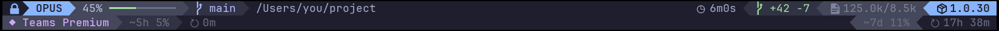

# Claude Code Statusline

A LazyVim lualine-style powerline statusbar for Claude Code, rendered with Catppuccin Mocha colors and true-color ANSI escape sequences.

## Example



- **Line 1** — model, effort level, context window, git branch, working directory, session stats, version
- **Line 2** — API usage with 5-hour and 7-day utilization (fetched from Anthropic API)
- **Line 3** — loaded skills (only appears when skills are active in the session)

All segments use powerline arrow separators with a gradient from bright accent colors to dark backgrounds.

## Features

### Line 1: Main Status Bar

| Segment | Description |
|---------|-------------|
| **Sandbox indicator** | Lock icon when sandbox enabled, warning triangle (red) when disabled. Reads `.claude/settings.local.json` > `.claude/settings.json` > `~/.claude/settings.json` with scope precedence. |
| **Model indicator** | Active model name (OPUS/SONNET/HAIKU) with accent color — blue for Opus, mauve for Sonnet, teal for Haiku. |
| **Effort level** | Reasoning effort (LOW/MEDIUM/HIGH/XHIGH) shown right of the model as a uniform dark chip — Text (`#cdd6f4`) on Surface0 (`#313244`). Read from the statusline `effort.level` field; hidden when the model doesn't support reasoning effort. |
| **Context window** | Percentage + visual progress bar (10 chars). Color-coded: green <50%, yellow 50-80%, red >80%. |
| **Git branch** | Current branch via `git branch --show-current`. |
| **Working directory** | CWD with `~` prefix, abbreviated to fit 30 characters (intermediate segments shortened to first char, e.g. `~/W/t/2026-03-19-statusline`). |
| **Session duration** | Elapsed time formatted as `Xh Ym`, `Xm Ys`, or `Xs`. |
| **Lines changed** | `+added -removed` from session cost data. |
| **Token counts** | Input/output tokens formatted as k/M (e.g. `125.0k/8.5k`). |
| **Version badge** | Claude Code version, accent-colored to match the model. |
| **Remote control** | "RC" badge (peach) when a `claude --remote-control` process is detected via `pgrep`. |

### Line 2: Usage Bar

| Segment | Description |
|---------|-------------|
| **Plan badge** | Detected plan tier: Pro, Max 5x, Max 20x, Teams Standard, Teams Premium, Free, or API. |
| **5-hour utilization** | Percentage with color coding + reset countdown (e.g. `5h 42%`, `↻ 3h 22m`). |
| **7-day utilization** | Percentage with color coding + reset countdown (e.g. `7d 12%`, `↻ 1d 17h`). |

Usage data details:
- Credentials read from **macOS Keychain** (service `Claude Code-credentials`) or `.credentials.json` on Linux
- Cached with **5-minute TTL** to reduce API calls
- **429 backoff**: 10-minute cooldown on rate limit errors (stale values shown with `~` prefix)
- **Multi-account support**: cache and keychain service keyed by `CLAUDE_CONFIG_DIR`

### Line 3: Skills Bar

| Segment | Description |
|---------|-------------|
| **SKILLS label** | Header badge, always shown when skills are loaded. |
| **Skill names** | Alternating Surface1/Surface0 backgrounds for readability. |
| **Overflow indicator** | `+N` when too many skills to fit terminal width. |

Skills are extracted from the session transcript file by scanning for skill loading markers. Cached by file mtime+size to avoid re-scanning unchanged transcripts.

### Cross-cutting

- **Catppuccin Mocha palette** — full 24-color theme (Mantle through Rosewater)
- **Powerline rendering** — right arrows (``) for left segments, left arrows (``) for right-aligned segments
- **Terminal width detection** — tries stdio fds 2/1/0, then `/dev/tty` via `ioctl`, then process tree walk for subprocess contexts
- **ANSI true-color** — 24-bit RGB escape sequences (`\033[38;2;R;G;Bm`)

## Requirements

- Python 3.6+
- A terminal with true-color (24-bit) support
- A [Nerd Font](https://www.nerdfonts.com/) for powerline separators and icons
- `git` on PATH (for branch detection)
- `pgrep` on PATH (for remote control detection)
- macOS Keychain access (for usage data on macOS) or `.credentials.json` (Linux)

No third-party Python packages required — uses only the standard library.

## Installation

Add to your Claude Code settings (`~/.claude/settings.json` or project `.claude/settings.json`):

```json
{
  "statusLine": {
    "type": "command",
    "command": "/path/to/statusline.py",
    "padding": 2
  }
}
```

Make the script executable:

```bash
chmod +x statusline.py
```

## Testing / Previewing

Run the script manually with mock JSON on stdin:

```bash
echo '{"model":{"display_name":"Opus"},"context_window":{"used_percentage":45,"total_input_tokens":125000,"total_output_tokens":8500},"workspace":{"current_dir":"/Users/you/project"},"version":"1.0.30","cost":{"total_duration_ms":360000,"total_lines_added":42,"total_lines_removed":7}}' | python3 statusline.py
```

Notes:
- Line 2 (usage) fetches real API data from your Keychain credentials, so values will vary
- Line 3 (skills) only appears when `transcript_path` is provided and contains skill markers
- Sandbox indicator reflects your actual `.claude/settings*.json` files in the mock CWD

## Configuration

| Environment Variable | Purpose |
|---------------------|---------|
| `CLAUDE_CONFIG_DIR` | Override the Claude config directory (default: `~/.claude`). Affects keychain service name, credential file path, and usage cache path. |
| `CLAUDE_STATUSLINE_SANDBOX` | Toggle the sandbox indicator. Set to `false`/`0`/`off`/`no`/`hide` to hide it; any other value (or unset) shows it. Overrides the config file. |
| `CLAUDE_STATUSLINE_PLAN` | Override the detected plan label on line 2 (e.g. `Max 5x`). Overrides the config file. |
| `HOME` | Used to abbreviate CWD with `~` prefix. |
| `COLUMNS` | Fallback terminal width when no tty is available (default: 80). |

### Config File (`statusline.json`)

Optional settings live in `statusline.json` inside your Claude config dir
(`~/.claude/statusline.json`, or `$CLAUDE_CONFIG_DIR/statusline.json`). The
matching environment variable above always wins over the file.

| Key | Type | Default | Purpose |
|-----|------|---------|---------|
## Subagent Status Line (companion feature)

`subagent-statusline.py` is a **separate Claude Code feature** from the main
statusline above — it is a different setting (`subagentStatusLine`) with a
different input/output contract. It does **not** touch the main status bar.
Instead it customizes the row body of each **subagent** shown in the agent
panel below the prompt (the rows you see when subagents are running, e.g. after
down-arrow). It is included here because it is closely related and reuses the
same Catppuccin Mocha palette and powerline styling.

Each subagent row is rendered as a compact chip group:

**`AGENT NAME`  ›  `↳ DEFINITION`  ›  `MODEL 4.8`  ›  `EFFORT`  ›  `NN%`  ›  task title**

| Chip | Description |
|------|-------------|
| **Agent name** | Shown **first** as a bold chip — the real agent type (`Explore`, `claude-code-guide`, `general-purpose`, or a custom `.claude/agents/*.md` name). This is **resolved from the session transcript**, not from the per-task `type` field (which is a generic `local_agent` label, identical for every agent kind — see below). Falls back to `type` if the spawn isn't in the transcript yet. |
| **Definition** (`↳`) | Only when the task also carries a distinct per-task `name` (an instance name): the row shows `name ↳ agent`, i.e. instance name first, then the resolved agent it was created from. Normal Task subagents don't have a distinct `name`, so only the single agent name is shown. |
| **Model** | The subagent's resolved model, mapped to a friendly label (`OPUS 4.8`, `HAIKU 4.5`, `SONNET 5`) with the same accent colors as the main bar. Omitted until the model is resolved. |
| **Effort** | Reasoning effort (`LOW`/`HIGH`/`XHIGH`/`MAX`) or a numeric token budget (e.g. `32k`). **Absent when the subagent inherits the session's effort level.** |
| **Context window** | The subagent's own usage (`tokenCount / contextWindowSize`) as `NN%`, color-coded green <50%, yellow 50–80%, red >80%. |
| **Title** | The task's `description` (a stable title, e.g. "Port REG-81 Race Results to iOS"), in Subtext color, truncated to fit. Falls back to the live `label` activity string only when there's no description. |

> **Field semantics (confirmed from captured live payloads):** the docs don't
> formally define the per-task fields, so these were verified by capturing real
> subagent rows:
> - **`type`** — a **generic transport label** that is `local_agent` for
>   *every* agent kind (Explore, claude-code-guide, general-purpose all report
>   the same value), so it can't name the agent. Used only as a fallback.
> - **`label`** — a **rolling activity string** ("Dumping Moe R1 race-card
>   hierarchy", sometimes multi-line streaming text), *not* a name. Never shown
>   as identity; used only as the trailing text when there's no description.
> - **`description`** — a stable task title. This is the trailing text.
> - **`name`** — *absent* for normal Task subagents. If it ever appears (e.g.
>   named agents) and differs from the resolved agent, it's treated as an
>   instance name and rendered `name ↳ agent`.
>
> **Resolving the real agent name.** Because no per-task field carries it, the
> script reads the session `transcript_path` (provided in stdin) and joins:
> a `Task`/`Agent` `tool_use` records `input.subagent_type`, and its
> `tool_result` records `toolUseResult.agentId` (== the per-task `id`). That
> join maps each task id to its real `subagent_type`. The result is cached in
> `~/.cache/claude-statusline/agenttypes-<hash>.json`, keyed by transcript
> mtime+size, and only lines containing `subagent_type`/`agentId` are parsed.
>
> Re-verify field values anytime with the debug dump under
> [Configuration](#configuration-subagent-status-line).

### How it differs from the main statusline

| | `statusLine` | `subagentStatusLine` |
|---|---|---|
| **Setting** | `statusLine` | `subagentStatusLine` |
| **Renders** | The main status bar | Each subagent row in the agent panel |
| **stdin** | One session object (`model`, `context_window`, `cost`, …) | A `tasks` array; each task has `id`, `name`, `type`, `status`, `description`, `label`, `startTime`, `model`, `effort`, `contextWindowSize`, `tokenCount`, `cwd` |
| **stdout** | Plain text (the rendered bar) | One JSON line per row: `{"id": "<task id>", "content": "<row body>"}`. Omit a task's id to keep its default rendering; emit an empty `content` to hide the row. |

### Available input fields

The stdin object contains the **base hook fields**, a `columns` field (usable
row width), and a `tasks` array. This script currently uses `type`, `name`,
`model`, `effort`, `contextWindowSize`, `tokenCount`, `description`, and `label`
— but the full set available to render is:

**Top level:**

| Field | Description |
|-------|-------------|
| `columns` | Usable row width for the display. |
| `tasks` | Array of subagent rows (see below). |
| `session_id` | Current session id. |
| `transcript_path` | Path to the session transcript. |
| `cwd` | Session working directory. |
| `permission_mode` | Active permission mode. |
| `hook_event_name` | The hook event that fired. |
| `prompt_id` | Present once there has been user input. |
| `agent_id` / `agent_type` | Present when the surrounding session is itself an agent (`--agent`). |

**Per task (`tasks[]`):**

| Field | Description |
|-------|-------------|
| `id` | Task id — **required** in your output to target the row. |
| `type` | Generic transport label (`local_agent` for every agent kind). Fallback only; the real agent name is resolved from the transcript. |
| `name` | Instance name — *absent* for normal Task subagents; shown as `name ↳ agent` when present and distinct. |
| `label` | Rolling live-activity string (can be multi-line). Used only as trailing text when there's no `description`. |
| `description` | Stable task title. Shown as the trailing text. |
| `status` | Current status. |
| `startTime` | When the task started. |
| `model` | Resolved model id (v2.1.205+; omitted until resolved). |
| `effort` | Reasoning effort level or numeric budget (v2.1.214+; absent when inherited). |
| `contextWindowSize` | Context window size in tokens (v2.1.205+). |
| `tokenCount` | Current token usage. |
| `tokenSamples` | Token usage samples. |
| `cwd` | The task's working directory. |

### Setup

Add a `subagentStatusLine` block alongside your existing `statusLine` in
`~/.claude/settings.json` (or a project `.claude/settings.json`), and make the
script executable:

```json
{
  "statusLine": {
    "type": "command",
    "command": "/path/to/statusline.py",
    "padding": 2
  },
  "subagentStatusLine": {
    "type": "command",
    "command": "/path/to/subagent-statusline.py"
  }
}
```

```bash
chmod +x subagent-statusline.py
```

Restart Claude Code (or start a new session) for the setting to take effect,
then spawn a subagent to see the chips.

**Version requirements:** the per-task `model` and `contextWindowSize` fields
require Claude Code **v2.1.205+**, and `effort` requires **v2.1.214+**. On older
versions those chips are simply skipped; the rest still renders.

### Known fragility

The agent-name resolution depends on **undocumented, internal** transcript
details that Claude Code is free to change between versions:

- The stdin `subagentStatusLine` schema (`tasks[]` field names, `columns`,
  `transcript_path`).
- The transcript JSONL shape used for the id → name join: a `Task`/`Agent`
  `tool_use` carrying `input.subagent_type`, and its `tool_result` carrying
  `toolUseResult.agentId` equal to the per-task `id`.
- The observed meaning of `type` (`local_agent`), `label` (rolling activity),
  and `description` (title) — none of which are formally specified.

The script is written to **degrade, not break**, if any of these change: if the
transcript can't be read or the join finds nothing, the row falls back to the
generic `type` (`local_agent`); if a chip's source field is missing, that chip
is dropped and the rest still renders. So a future Claude Code update would at
worst return the row to a less-informative state — it won't error. If names
regress to `local_agent`, re-capture a payload with
`CLAUDE_SUBAGENT_STATUSLINE_DEBUG` (see below), diff the transcript shape, and
update `resolve_agent_types()` accordingly.

### Testing / Previewing

Run the script manually with a mock `tasks` array on stdin:

```bash
echo '{"columns":90,"tasks":[
  {"id":"t1","description":"search the auth module","model":"claude-opus-4-8","effort":"high","contextWindowSize":200000,"tokenCount":45000},
  {"id":"t2","label":"implementing spec","model":"claude-haiku-4-5-20251001","contextWindowSize":200000,"tokenCount":170000}
]}' | python3 subagent-statusline.py
```

### Configuration (subagent status line)

| Environment Variable | Purpose |
|---------------------|---------|
| `CLAUDE_SUBAGENT_STATUSLINE_DEBUG` | Path to a file. When set, every raw stdin payload is appended to it (one JSON object per line) before rendering. Use this to inspect the **real** `name`/`type`/`label`/`model`/… values your subagents produce, since the docs don't formally define them. Unset by default; failures to write are ignored. |

Capture real values by pointing it at a file (e.g. via the `env` block in
`settings.json`), then running a subagent and inspecting the dump:

```json
{
  "env": { "CLAUDE_SUBAGENT_STATUSLINE_DEBUG": "/tmp/subagent-statusline.jsonl" }
}
```

```bash
tail -f /tmp/subagent-statusline.jsonl | python3 -m json.tool
```

| `show_sandbox` | bool | `true` | Show the leftmost sandbox indicator. Set to `false` to hide it. |
| `plan_override` | string | — | Force the plan label shown on line 2. |

```json
{
  "show_sandbox": false
}
```

The recommended, officially-supported alternative is to set the environment
variable in your `settings.json` `env` block, which Claude Code passes through
to the statusline command:

```json
{
  "env": { "CLAUDE_STATUSLINE_SANDBOX": "false" }
}
```

### Settings File Precedence (Sandbox)

The sandbox indicator reads from settings files in this order (first match wins):

1. `<cwd>/.claude/settings.local.json` — local project (highest priority)
2. `<cwd>/.claude/settings.json` — shared project
3. `~/.claude/settings.json` — user global (lowest priority)

## How It Works

```
stdin (JSON) → parse fields → build segments → render powerline → stdout (ANSI)
```

1. Claude Code pipes a JSON object to stdin on each status update
2. The script parses model info, context window stats, workspace, version, and cost data
3. Three lines of powerline segments are built with the Catppuccin Mocha color palette
4. Left segments use right-pointing arrows (``) and right segments use left-pointing arrows (``)
5. Lines are right-aligned using terminal width detection
6. Usage data (line 2) is fetched from `api.anthropic.com` with caching and backoff
7. Skills (line 3) are scanned from the transcript file with mtime-based caching
8. Rendered ANSI output is printed to stdout

## Input JSON Reference

The script reads the following fields from the JSON object piped to stdin:

```json
{
  "model": {
    "display_name": "Opus"          // Model name — used for label and accent color
  },
  "context_window": {
    "used_percentage": 45,           // Context window usage (0-100)
    "total_input_tokens": 125000,    // Total input tokens consumed
    "total_output_tokens": 8500      // Total output tokens consumed
  },
  "workspace": {
    "current_dir": "/Users/you/project"  // Absolute working directory path
  },
  "version": "1.0.30",              // Claude Code version string
  "cost": {
    "total_duration_ms": 360000,     // Session duration in milliseconds
    "total_lines_added": 42,         // Lines added during session
    "total_lines_removed": 7         // Lines removed during session
  },
  "transcript_path": "/path/to/transcript.jsonl"  // Session transcript (for skills detection)
}
```

All fields are optional — the script gracefully handles missing data with sensible defaults.
